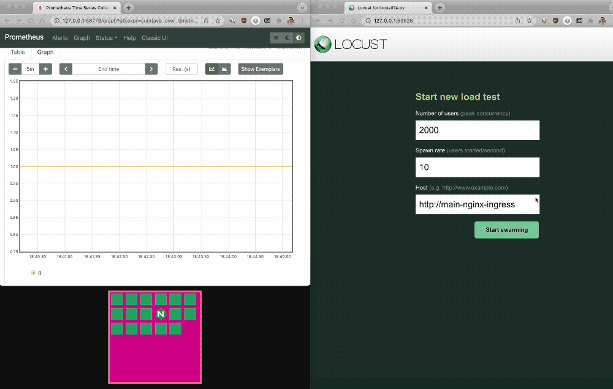
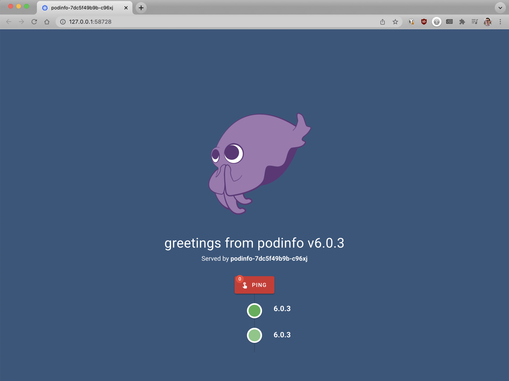
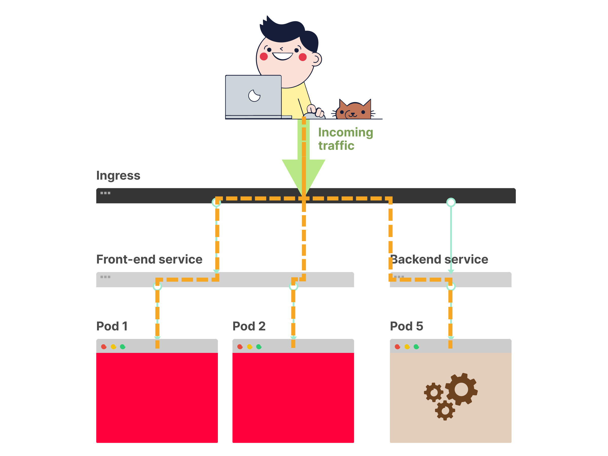
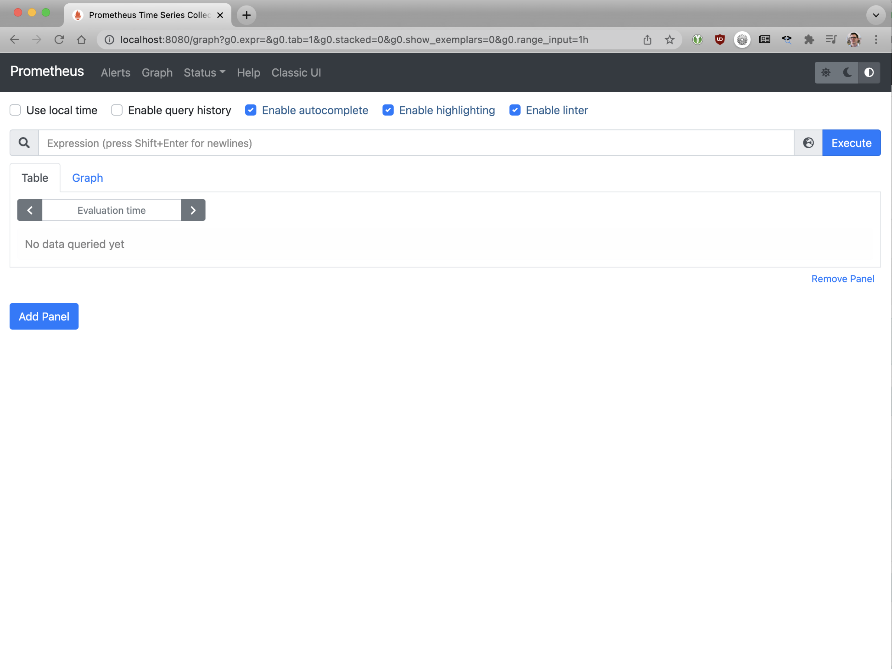
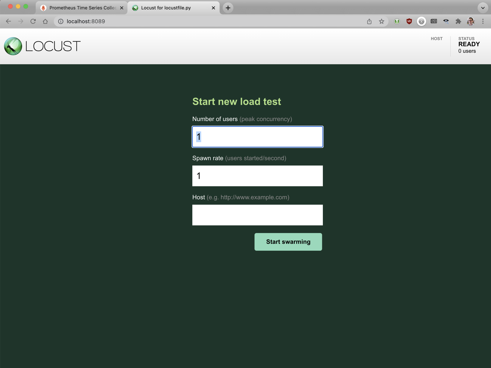
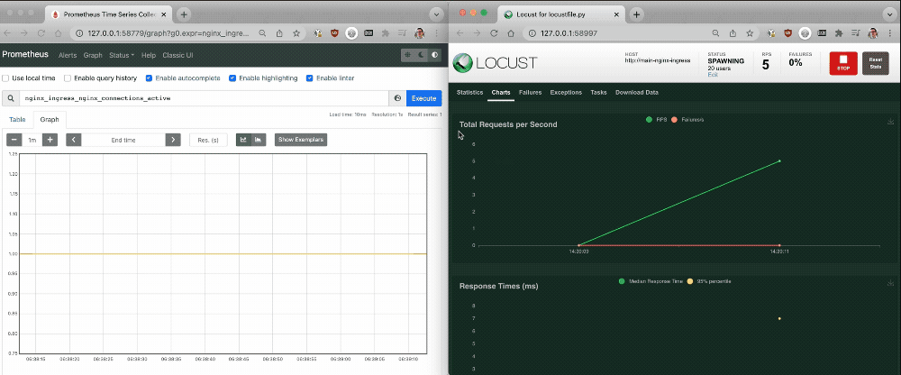
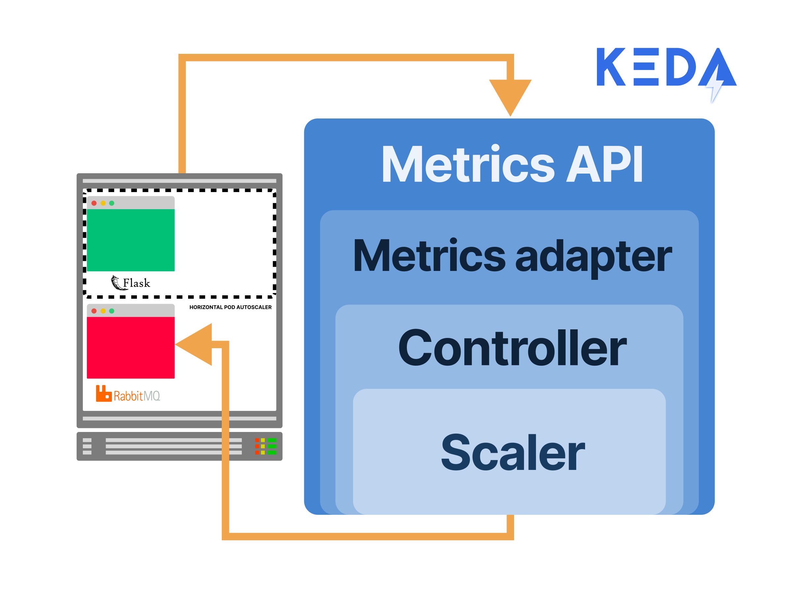

_TL;DR: In this article, you will learn how to deploy the NGINX Ingress Controller and autoscale it based on the number of active requests with Prometheus and KEDA._



# Overview
When you expose applications from your Kubernetes cluster to the public internet, you often need a component that can:

- Forward requests to the correct application based on paths, domain names, headers, etc.
- Ingest a large number of requests while keeping a low latency.
- Terminate SSL.
- Apply policies such as rate limiting and authentication.

Since those are very common operations, Kubernetes provides a built-in mechanism to collect and list the requirements for each [routing decision via the Ingress.](https://kubernetes.io/docs/concepts/services-networking/ingress/)

However, it does not prescribe how those requirements are fulfilled.

In other words, there is no application preinstalled that can route the traffic to your Pods.

Instead, you should install it by yourself.

You can install the [NGINX Ingress Controller](https://github.com/nginxinc/kubernetes-ingress/) in your cluster and make it the designed component to route traffic (and protect) your app.

Let's have a look at how it works.

## Creating a cluster and deploying an app

Let's start by creating a local cluster with minikube:

```bash
minikube start --memory=4G
😄  minikube v1.24.0
✨  Automatically selected the docker driver
👍  Starting control plane node in cluster
🚜  Pulling base image ...
🔥  Creating docker container (CPUs=2, Memory=4096MB) ...
🐳  Preparing Kubernetes v1.22.3 on Docker 20.10.8 ...
    ▪ Generating certificates and keys ...
    ▪ Booting up control plane ...
    ▪ Configuring RBAC rules ...
🔎  Verifying Kubernetes components...
    ▪ Using image gcr.io/k8s-minikube/storage-provisioner:v5
🌟  Enabled addons: storage-provisioner, default-storageclass
🏄  Done! kubectl is now configured to use the cluster and "default" namespace by default
```

Before exploring how to expose an application to your Kubernetes cluster, let's create the app itself.

The following definition creates a Deployment with a single replica and a Service:

```yaml
apiVersion: apps/v1
kind: Deployment
metadata:
  name: podinfo
spec:
  selector:
    matchLabels:
      app: podinfo
  template:
    metadata:
      labels:
        app: podinfo
    spec:
      containers:
      - name: podinfo
        image: stefanprodan/podinfo
        ports:
        - containerPort: 9898
---
apiVersion: v1
kind: Service
metadata:
  name: podinfo
spec:
  ports:
    - port: 80
      targetPort: 9898
      nodePort: 30009
  selector:
    app: podinfo
  type: LoadBalancer
```

You can submit the YAML file with:

```terminal|command=1|title=bash
$ kubectl apply -f 1-deployment.yaml
deployment.apps/podinfo configured
```

And you can visit the app with:

```bash
$ minikube service podinfo
|-----------|---------|-------------|---------------------------|
| NAMESPACE |  NAME   | TARGET PORT |            URL            |
|-----------|---------|-------------|---------------------------|
| default   | podinfo |          80 | http://192.168.49.2:31190 |
|-----------|---------|-------------|---------------------------|
🏃  Starting tunnel for service podinfo.
|-----------|---------|-------------|------------------------|
| NAMESPACE |  NAME   | TARGET PORT |          URL           |
|-----------|---------|-------------|------------------------|
| default   | podinfo |             | http://127.0.0.1:51546 |
|-----------|---------|-------------|------------------------|
🎉  Opening service default/podinfo in default browser...
```

At this point, you should see the app.

**Note:** If you are in the F5 Unified Demo Framework (UDF), use the Podinfo access method to view the app.



```bash
$ minikube service --all
😿  service default/kubernetes has no node port
|-----------|------------|--------------|---------------------------|
| NAMESPACE |    NAME    | TARGET PORT  |            URL            |
|-----------|------------|--------------|---------------------------|
| default   | kubernetes | No node port |
| default   | podinfo    |           80 | http://192.168.49.2:32379 |
|-----------|------------|--------------|---------------------------|

curl http://192.168.49.2:32379
{
  "hostname": "podinfo-5d76864686-b9c6t",
  "version": "6.0.3",
  "revision": "",
  "color": "#34577c",
  "logo": "https://raw.githubusercontent.com/stefanprodan/podinfo/gh-pages/cuddle_clap.gif",
  "message": "greetings from podinfo v6.0.3",
  "goos": "linux",
  "goarch": "amd64",
  "runtime": "go1.16.9",
  "num_goroutine": "6",
  "num_cpu": "6"
}
```

_There's an issue, though._

You used a service of `type: LoadBalancer` that in turn:

- Creates an actual load balancer, if you are using a cloud provider such as Azure, AWS or GCP or
- Sits idle doing nothing if you are on a bare-metal cluster — unless you install [MetalLB](https://metallb.universe.tf/) or [Kube-VIP](https://kube-vip.chipzoller.dev/).

Either way, you should notice that the service exposes a single set of Pods.

If you have multiple services that need to be exposed, you might need to create the same amount of load balancers.

_Imagine having ten applications that have to be exposed; you might end up with ten Load Balancers._

**That wouldn't be a problem if those load balancers weren't so expensive.**

_How can you get around this issue?_

## The Ingress manifest and the ingress controller

In Kubernetes, another resource is designed to solve the problem with proliferating load balancers: the Ingress.

The Ingress has two parts:

1. The first is the **Ingress manifest**, which is the same as Deployment or Service in Kubernetes.
1. The second part is the **Ingress controller**. This is the actual part that sends the traffic to the pods.

In other words, the Ingress controller acts as a reverse proxy that routes the traffic to your Pods.



The Ingress routes the traffic based on paths, domains, headers, etc., consolidating multiple endpoints in a single resource that runs inside Kubernetes.

With this, you can serve multiple services simultaneously from one exposed load balancer.

Kubernetes doesn't come with an Ingress Controller preinstalled.

Instead, you have to choose and install it by yourself.

[There are several competing products in this space,](https://docs.google.com/spreadsheets/d/191WWNpjJ2za6-nbG4ZoUMXMpUK8KlCIosvQB0f-oq3k/) but you will use the NGINX Ingress Controller in this article.

Let's see it in action.

## Installing the NGINX Ingress controller

The quicker way to install the controller is to use Helm.

[You can find the instructions on how to install Helm on the official website.](https://helm.sh/docs/intro/install)

Next, add the following repository to Helm:

```bash
$ helm repo add nginx-stable https://helm.nginx.com/stable
"nginx-stable" has been added to your repositories
```

Next, you can download and install the NGINX Ingress Controller in your cluster with:

```bash
$ helm install main nginx-stable/nginx-ingress \
  --set controller.watchIngressWithoutClass=true
NAME: main
NAMESPACE: default
STATUS: deployed
REVISION: 1
The NGINX Ingress Controller has been installed.
```

Verify that the controller is running with:

```bash
$ kubectl get pods -l "app=main-nginx-ingress"
NAME                                  READY   STATUS    RESTARTS
main-nginx-ingress-6494446486-fvr6k   1/1     Running   0
```

You're ready to use the Ingress manifest to route traffic to your app.

You can use the following Ingress manifest definition to start:

```yaml
apiVersion: networking.k8s.io/v1
kind: Ingress
metadata:
  name: podinfo
spec:
  ingressClassName: nginx
  rules:
    - host: "example.com"
      http:
        paths:
          - backend:
              service:
                name: podinfo
                port:
                  number: 80
            path: /
            pathType: Prefix
```

You can submit the Ingress manifest to your cluster with:

```bash
$ kubectl apply -f 2-ingress.yaml
ingress.networking.k8s.io/podinfo created
```

Now let's expose the Ingress with:

```bash
$ minikube service main-nginx-ingress --url
🏃  Starting tunnel for service main-nginx-ingress.
|-----------|--------------------|-------------|------------------------|
| NAMESPACE |        NAME        | TARGET PORT |          URL           |
|-----------|--------------------|-------------|------------------------|
| default   | main-nginx-ingress |             | http://127.0.0.1:55431 |
|           |                    |             | http://127.0.0.1:55432 |
|-----------|--------------------|-------------|------------------------|
http://127.0.0.1:55431
http://127.0.0.1:55432
```

> Unfortunately, you can't open those URLs in the browser as you need to include the domain name in the request.

You can use the first URL to issue a request to your app:

```bash
$ curl -H "Host: example.com" http://127.0.0.1:55431
{
  "hostname": "podinfo-7dc5f49b9b-xdd5d",
  "version": "6.0.3",
  "revision": "",
  "color": "#34577c",
  "logo": "https://raw.githubusercontent.com/stefanprodan/podinfo/gh-pages/cuddle_clap.gif",
  "message": "greetings from podinfo v6.0.3",
  "goos": "linux",
  "goarch": "arm64",
  "runtime": "go1.16.9",
  "num_goroutine": "6",
  "num_cpu": "4"
}
```

_Excellent, it worked!_

Now that you have an Ingress controller that can route the traffic to your apps, it's time to think about scaling it.

## Inspecting metrics exposed by the NGINX Ingress Controller

As you already discovered, the Ingress controller is just a regular Pod that bundles a reverse proxy (NGINX) with some code that integrates with Kubernetes.

If you receive a lot of traffic, you might want to scale the number of Nginx Pods and increase the replica count.

_How do you do that, though?_

First, you need metrics.

Luckily, [Nginx already exposes a few metrics for us.](https://github.com/nginxinc/nginx-prometheus-exporter#exported-metrics)

Let's explore the metrics by creating a temporary pod:

```bash
$ kubectl run -ti --rm=true busybox --image=busybox
```

Once ready, you should issue a request to the NGINX Ingress pod on port 9113:

```bash
$ wget -qO- 172.17.0.4:9113/metrics
nginx_ingress_controller_ingress_resources_total{class="nginx",type="master"} 0
nginx_ingress_controller_ingress_resources_total{class="nginx",type="minion"} 0
nginx_ingress_controller_ingress_resources_total{class="nginx",type="regular"} 1
# truncated output
```

> You can retrieve the IP address of the pod with `kubectl get pods -o wide`.

You should see a relatively long list of metrics that Nginx keeps up to date.

_Which one should you use?_

It's probably a good idea to scale the Nginx Pods before it is overwhelmed by requests.

So you will track the `nginx_connections_active` metric that keeps track of how many requests are actively processed by NGINX.

There's a missing link, though.

_How do you expose the Nginx metrics to Kubernetes?_

For that, you need:

1. A mechanism to scrape the metrics.
1. A tool to store and expose the metrics so that Kubernetes can use them.

For the first task, you will use [Prometheus.](https://prometheus.io/)

For the second task, you will install [KEDA.](https://keda.sh/)

_Let's start._

## Collecting metrics with Prometheus

You can install Prometheus using Helm:

```bash
$ helm repo add prometheus-community https://prometheus-community.github.io/helm-charts
"prometheus-community" has been added to your repositories
$ helm install prometheus prometheus-community/prometheus \
  --set server.service.type=NodePort --set server.service.nodePort=30010
NAME: prometheus
NAMESPACE: default
STATUS: deployed
REVISION: 1
TEST SUITE: None
```

Run `kubectl get pods` and wait until all `prometheus` pods have a `RUNNING` status.

When the installation is complete, you can connect to the dashboard with:

```bash
$ minikube service prometheus-server
|-----------|-------------------|-------------|--------------|
| NAMESPACE |       NAME        | TARGET PORT |     URL      |
|-----------|-------------------|-------------|--------------|
| default   | prometheus-server |             | No node port |
|-----------|-------------------|-------------|--------------|
😿  service default/prometheus-server has no node port
🏃  Starting tunnel for service prometheus-server.
|-----------|-------------------|-------------|------------------------|
| NAMESPACE |       NAME        | TARGET PORT |          URL           |
|-----------|-------------------|-------------|------------------------|
| default   | prometheus-server |             | http://127.0.0.1:52276 |
|-----------|-------------------|-------------|------------------------|
🎉  Opening service default/prometheus-server in default browser...
```

You should see the dashboard:

**Note:** If you are in the F5 Unified Demo Framework (UDF), use the Prometheus access method to view the Prometheus dashboard. 



Go ahead and try the first query.

Let's search for the `nginx_ingress_nginx_connections_active` metric.

Well, there are zero active connections.

That makes sense since you are not handling any traffic at the moment.

To generate some traffic, you will use [Locust.](https://locust.io)

The following YAML definition creates a Pod for our load generator.

```yaml
apiVersion: v1
kind: ConfigMap
metadata:
  name: locust-script
data:
  locustfile.py: |-
    from locust import HttpUser, task, between

    class QuickstartUser(HttpUser):
        wait_time = between(0.7, 1.3)

        @task
        def hello_world(self):
            self.client.get("/", headers={"Host": "example.com"})
---
apiVersion: apps/v1
kind: Deployment
metadata:
  name: locust
spec:
  selector:
    matchLabels:
      app: locust
  template:
    metadata:
      labels:
        app: locust
    spec:
      containers:
        - name: locust
          image: locustio/locust
          ports:
            - containerPort: 8089
          volumeMounts:
            - mountPath: /home/locust
              name: locust-script
      volumes:
        - name: locust-script
          configMap:
            name: locust-script
---
apiVersion: v1
kind: Service
metadata:
  name: locust
spec:
  ports:
    - port: 8089
      targetPort: 8089
      nodePort: 30015
  selector:
    app: locust
  type: LoadBalancer
```

You can submit to the cluster with:

```bash
$ kubectl apply -f 3-locust.yaml
configmap/locust-script created
deployment.apps/locust created
service/locust created
```

Locust reads the following `locustfile.py`, which is stored in a ConfigMap:

```py
from locust import HttpUser, task, between

class QuickstartUser(HttpUser):
    wait_time = between(0.7, 1.3)

    @task
    def hello_world(self):
        self.client.get("/", headers={"Host": "example.com"})
```

The script issues a request to the pod with the correct headers.

Let's open the Locust dashboard with:

```bash
$ minikube service locust
|-----------|--------|-------------|---------------------------|
| NAMESPACE |  NAME  | TARGET PORT |            URL            |
|-----------|--------|-------------|---------------------------|
| default   | locust |        8089 | http://192.168.49.2:31887 |
|-----------|--------|-------------|---------------------------|
🏃  Starting tunnel for service locust.
|-----------|--------|-------------|------------------------|
| NAMESPACE |  NAME  | TARGET PORT |          URL           |
|-----------|--------|-------------|------------------------|
| default   | locust |             | http://127.0.0.1:58880 |
|-----------|--------|-------------|------------------------|
🎉  Opening service default/locust in default browser...
```

**Note:** If you are in the F5 Unified Demo Framework (UDF), use the Locust access method to view the Locust dashboard.



Enter the following details:

- Number of users: **1000**
- Spawn rate: **10**
- Host: `http://main-nginx-ingress`

Click on start and observe the traffic reaching the Ingress controller.

Keep an eye on the Prometheus dashboard; as a vast amount of connections are issued, Nginx might not be able to process all of them with reasonable latency.



If you pay attention, you might notice that you could use the `nginx_ingress_nginx_connections_active` metric to scale your deployment.

The number increases as the NGINX handles more requests.

For example, you could say that when there are more than 100 active connections, it's perhaps time to add another NGINX Pod.

_Let's do that._

## Autoscaling active request with KEDA

KEDA is a Kubernetes event-driven autoscaler.

One of the most compelling features of KEDA is that it integrates a metrics server (the component that stores and transforms metrics for Kubernetes), and it can also consume metrics directly from Prometheus (as well as other tools).



Let's install KEDA with Helm.

```bash
$ helm repo add kedacore https://kedacore.github.io/charts
"kedacore" has been added to your repositories
$ helm install keda kedacore/keda
NAME: keda
NAMESPACE: default
STATUS: deployed
REVISION: 1
TEST SUITE: None
```

You can verify that KEDA is running with:

```bash
$ kubectl get pods
NAME                                              READY   STATUS
keda-operator-5748df494c-96svq                    0/1     Running
keda-operator-metrics-apiserver-cb649dd48-599nh   1/1     Running
locust-7885f7b458-txls9                           1/1     Running
main-nginx-ingress-6494446486-fvr6k               1/1     Running
podinfo-7dc5f49b9b-xdd5d                          1/1     Running
prometheus-alertmanager-779c4c7777-9cx7j          2/2     Running
prometheus-kube-state-metrics-68b6c8b5c5-49rmd    1/1     Running
prometheus-node-exporter-p7gh4                    1/1     Running
prometheus-pushgateway-7975bf5d4d-tnzvj           1/1     Running
prometheus-server-6fb976647c-tc94m                2/2     Running
```

It's time to define how the NGINX controller should scale.

For that, KEDA has a unique object called [ScaledObject:](https://keda.sh/docs/1.4/concepts/scaling-deployments/#scaledobject-spec)

```yaml
apiVersion: keda.sh/v1alpha1
kind: ScaledObject
metadata:
 name: nginx-scale
spec:
 scaleTargetRef:
   kind: Deployment
   name: main-nginx-ingress
 minReplicaCount: 1
 maxReplicaCount: 20
 cooldownPeriod: 30
 pollingInterval: 1
 triggers:
 - type: prometheus
   metadata:
     serverAddress: http://prometheus-server
     metricName: nginx_connections_active_keda
     query: |
       sum(avg_over_time(nginx_ingress_nginx_connections_active{app="main-nginx-ingress"}[1m]))
     threshold: "100"
```

You can submit the object with:

```bash
$ kubectl apply -f 4-scaled-object.yaml
scaledobject.keda.sh/nginx-scale created
```

It's time to test if the scaling works.

Open the Locust dashboard and repeat the experiment with the following settings:

- Number of users: **2000**
- Spawn rate: **10**
- Host: `http://main-nginx-ingress`


The number of replicas is increasing!

Excellent!

_But how does KEDA work?_

KEDA bridges the metrics collected by Prometheus and feeds them to Kubernetes.

It creates a [Horizontal Pod Autoscaler (HPA)](https://kubernetes.io/docs/tasks/run-application/horizontal-pod-autoscale/) with those metrics.

You can manually inspect the HPA with:

```bash
$ kubectl get hpa
NAME                   REFERENCE                       TARGETS       MINPODS   MAXPODS   REPLICAS
keda-hpa-nginx-scale   Deployment/main-nginx-ingress   0/100 (avg)   1         20        1

$ kubectl describe hpa keda-hpa-nginx-scale
Name:                                                       keda-hpa-nginx-scale
CreationTimestamp:                                          Fri, 07 Jan 2022 13:36:21 +0800
Reference:                                                  Deployment/main-nginx-ingress
Metrics:                                                    ( current / target )
  "nginx_connections_waiting_keda" (target average value):  78334m / 200
Min replicas:                                               1
Max replicas:                                               20
Deployment pods:                                            6 current / 6 desired
Conditions:
  Type            Status  Reason               Message
  ----            ------  ------               -------
  AbleToScale     True    ScaleDownStabilized  recent recommendations were higher than current one, applying the highest recent recommendation
  ScalingActive   True    ValidMetricFound     the HPA was able to successfully calculate a replica count from external metric nginx_connections_waiting_keda
  ScalingLimited  False   DesiredWithinRange   the desired count is within the acceptable range
Events:
  Type    Reason             From                       Message
  ----    ------             ----   ----                       -------
  Normal  SuccessfulRescale  horizontal-pod-autoscaler  New size: 3; reason: All metrics below target
  Normal  SuccessfulRescale  horizontal-pod-autoscaler  New size: 2; reason: All metrics below target
  Normal  SuccessfulRescale  horizontal-pod-autoscaler  New size: 1; reason: All metrics below target
  Normal  SuccessfulRescale  horizontal-pod-autoscaler  New size: 4; reason: external metric nginx_connections_waiting_keda above target
  Normal  SuccessfulRescale  horizontal-pod-autoscaler  New size: 6; reason: external metric nginx_connections_waiting_keda above target
```

## Summary

In this article, you learned:

- How the Ingress is the preferred choice to manage incoming connections in your cluster.
- How to install the NGINX Ingress Controller using Helm.
- How to collect metrics and autoscale the NGINX pods with Prometheus and KEDA.
- How to generate traffic for load testing with Locust.