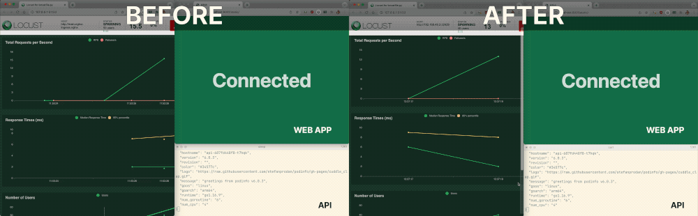
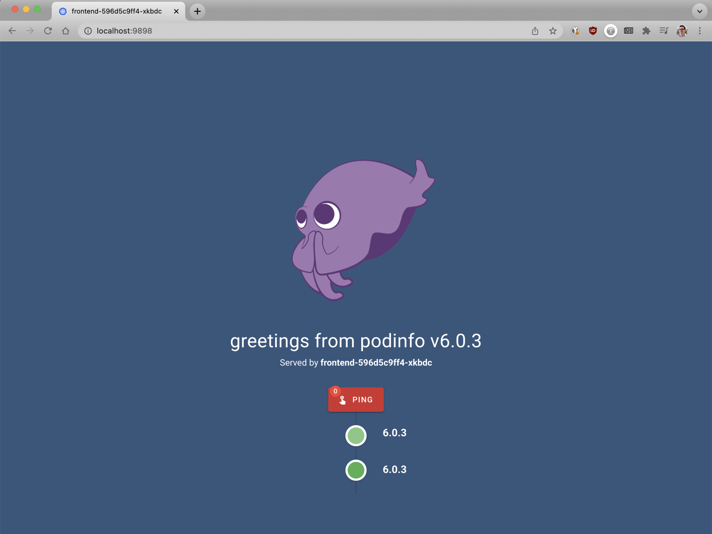
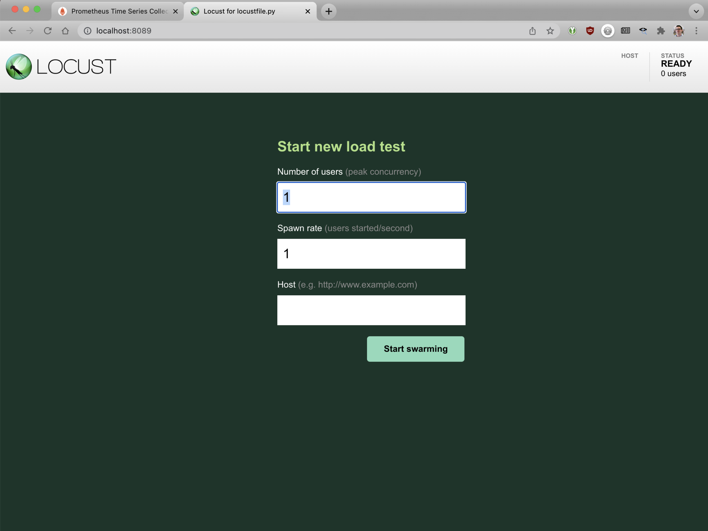
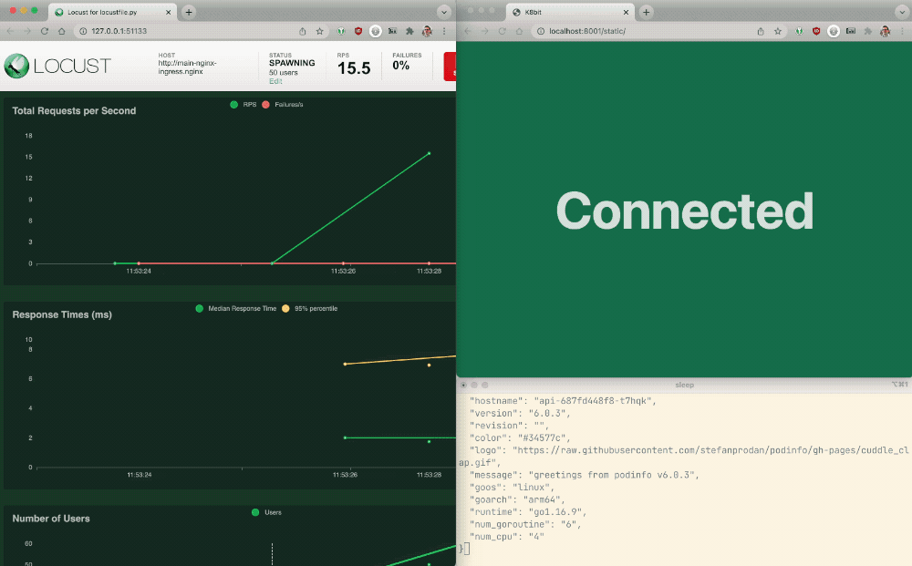
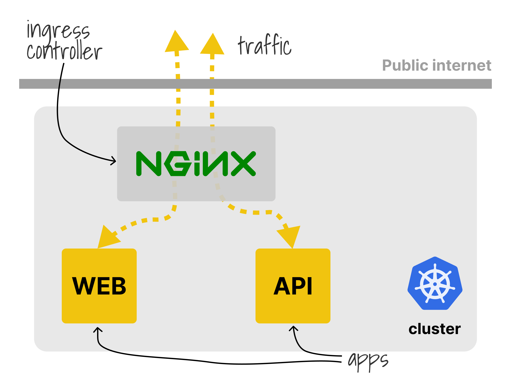
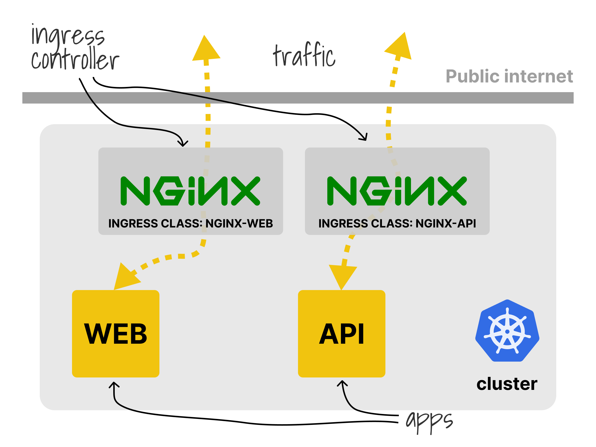
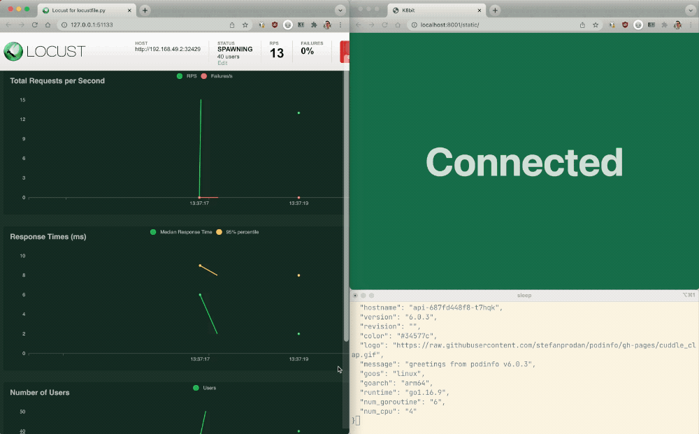

_TL;DR: In this article, you will learn how to deploy public and private facing NGINX ingress controllers and set rate limits to secure an API._



In Kubernetes, there are many reasons why you might need to have multiple ingress controllers:

- You might want to expose a subset of apps to the public while keeping others accessible only in your private network.
- You might run different workloads that require different controllers (e.g. an ingress controller for web apps, another for a public-facing API).
- You have to segregate workload and apps and limit your blast radius.

If you face any of those issues, it is recommended to shard ingresses across multiple ingress controllers.

Let's explore the subject with an example.

## Creating a cluster and deploying an app

Let's start by creating a local cluster with minikube:

```bash
minikube start --memory=4G
😄  minikube v1.24.0
✨  Automatically selected the docker driver
👍  Starting control plane node in cluster
🚜  Pulling base image ...
🔥  Creating docker container (CPUs=2, Memory=4096MB) ...
🐳  Preparing Kubernetes v1.22.3 on Docker 20.10.8 ...
    ▪ Generating certificates and keys ...
    ▪ Booting up control plane ...
    ▪ Configuring RBAC rules ...
🔎  Verifying Kubernetes components...
    ▪ Using image gcr.io/k8s-minikube/storage-provisioner:v5
🌟  Enabled addons: storage-provisioner, default-storageclass
🏄  Done! kubectl is now configured to use the cluster and "default" namespace by default
```

Let's create two apps:

1. A web application that renders an HTML page and
1. An API that returns a JSON payload.

```yaml
apiVersion: apps/v1
kind: Deployment
metadata:
  name: api
spec:
  selector:
    matchLabels:
      app: api
  template:
    metadata:
      labels:
        app: api
    spec:
      containers:
        - name: api
          image: stefanprodan/podinfo
          ports:
            - containerPort: 9898
---
apiVersion: v1
kind: Service
metadata:
  name: api
spec:
  ports:
    - port: 80
      targetPort: 9898
  selector:
    app: api
---
apiVersion: apps/v1
kind: Deployment
metadata:
  name: frontend
spec:
  selector:
    matchLabels:
      app: frontend
  template:
    metadata:
      labels:
        app: frontend
    spec:
      containers:
        - name: frontend
          image: stefanprodan/podinfo
          ports:
            - containerPort: 9898
---
apiVersion: v1
kind: Service
metadata:
  name: frontend
spec:
  ports:
    - port: 80
      targetPort: 9898
  selector:
    app: frontend
```

You can submit the resources to the cluster with:

```bash
$ kubectl apply -f 1-apps.yaml
deployment.apps/api created
service/api created
deployment.apps/frontend created
service/frontend created
```

You have to install an Ingress controller and create an Ingress manifest to expose the applications.

Let's install the [NGINX Ingress Controller](https://github.com/nginxinc/kubernetes-ingress/) in a separate namespace with Helm:

```bash
$ kubectl create namespace nginx
namespace/nginx created
$ helm repo add nginx-stable https://helm.nginx.com/stable
"nginx-stable" has been added to your repositories
$ helm install main nginx-stable/nginx-ingress \
  --set controller.ingressClass=nginx \
  --namespace nginx
NAME: main
NAMESPACE: nginx
STATUS: deployed
REVISION: 1
The NGINX Ingress Controller has been installed.
```

At this point, you can create an Ingress manifest to route the traffic to the apps:

```yaml
apiVersion: networking.k8s.io/v1
kind: Ingress
metadata:
  name: first
spec:
  ingressClassName: nginx
  rules:
    - host: "example.local"
      http:
        paths:
          - backend:
              service:
                name: frontend
                port:
                  number: 80
            path: /
            pathType: Prefix
    - host: "api.example.local"
      http:
        paths:
          - backend:
              service:
                name: api
                port:
                  number: 80
            path: /
            pathType: Prefix
```

You can submit the resource to the cluster with:

```bash
$ kubectl apply -f 2-ingress.yaml
ingress.networking.k8s.io/first created
```

Let's verify that the traffic is routed correctly to the API.

First, retrieve the list of services in the nginx namespace with:

```bash
$ kubectl get service --namespace nginx
NAME                 TYPE           CLUSTER-IP      EXTERNAL-IP   PORT(S)
main-nginx-ingress   LoadBalancer   10.98.187.145   <pending>     80:30369/TCP,443:32687/TCP
```

Then, launch a disposable busybox pod in the cluster with:

```bash
$ kubectl run -ti --rm=true busybox --image=busybox
```

Once ready, you should issue a request to the NGINX Ingress pod with the correct hostname:

```bash
$ wget --header="Host: api.example.local" -qO- main-nginx-ingress.nginx
{
  "hostname": "api-687fd448f8-t7hqk",
  "version": "6.0.3",
  "revision": "",
  "color": "#34577c",
  "logo": "https://raw.githubusercontent.com/stefanprodan/podinfo/gh-pages/cuddle_clap.gif",
  "message": "greetings from podinfo v6.0.3",
  "goos": "linux",
  "goarch": "arm64",
  "runtime": "go1.16.9",
  "num_goroutine": "6",
  "num_cpu": "4"
}
```

_What about the web app?_

You can still use the busybox to simulate a web browser and retrieve the webpage with:

```bash
$ wget --header="Host: example.local" --header="User-Agent: Mozilla" -qO- main-nginx-ingress.nginx
<!DOCTYPE html>
<html>
<head>
  <title>frontend-596d5c9ff4-xkbdc</title>
# truncated output
```

The webpage rendered in the browser should look like this:



Excellent!

The NGINX Ingress controller receives the request and dispatches it to the right pod.

_What happens when your API is overwhelmed with requests? Does the NGINX pod reserve some bandwidth to the web app?_

Let's find out.

## Generating traffic to the API

You use locust to generate the traffic to the API and web page.

```yaml
apiVersion: v1
kind: ConfigMap
metadata:
  name: locust-script
data:
  locustfile.py: |-
    from locust import HttpUser, task, between

    class QuickstartUser(HttpUser):
        wait_time = between(0.7, 1.3)

        @task(1)
        def visit_website(self):
            with self.client.get("/", headers={"Host": "example.local", "User-Agent": "Mozilla"}, timeout=0.2, catch_response=True) as response:
                if response.request_meta["response_time"] > 200:
                    response.failure("Frontend failed")
                else:
                    response.success()


        @task(5)
        def visit_api(self):
            with self.client.get("/", headers={"Host": "api.example.local"}, timeout=0.2) as response:
                if response.request_meta["response_time"] > 200:
                    response.failure("API failed")
                else:
                    response.success()
---
apiVersion: apps/v1
kind: Deployment
metadata:
  name: locust
spec:
  selector:
    matchLabels:
      app: locust
  template:
    metadata:
      labels:
        app: locust
    spec:
      containers:
        - name: locust
          image: locustio/locust
          ports:
            - containerPort: 8089
          volumeMounts:
            - mountPath: /home/locust
              name: locust-script
      volumes:
        - name: locust-script
          configMap:
            name: locust-script
---
apiVersion: v1
kind: Service
metadata:
  name: locust
spec:
  ports:
    - port: 80
      targetPort: 8089
  selector:
    app: locust
---
apiVersion: networking.k8s.io/v1
kind: Ingress
metadata:
  name: locust
spec:
  ingressClassName: nginx
  rules:
    - host: "locust.example.local"
      http:
        paths:
          - backend:
              service:
                name: locust
                port:
                  number: 80
            path: /
            pathType: Prefix
```

You can submit the resource to the cluster with:

```bash
$ kubectl apply -f 3-locust.yaml
configmap/locust-script created
deployment.apps/locust created
service/locust created
```

Locust reads the `locustfile.py`, which is stored in a ConfigMap:

```py
from locust import HttpUser, task, between

class QuickstartUser(HttpUser):
    wait_time = between(0.7, 1.3)

    @task(1)
    def visit_website(self):
        with self.client.get("/", headers={"Host": "example.local", "User-Agent": "Mozilla"}, timeout=0.2, catch_response=True) as response:
            if response.request_meta["response_time"] > 200:
                response.failure("Frontend failed")
            else:
                response.success()


    @task(5)
    def visit_api(self):
        with self.client.get("/", headers={"Host": "api.example.local"}, timeout=0.2) as response:
            if response.request_meta["response_time"] > 200:
                response.failure("API failed")
            else:
                response.success()
```

In this scenario, we simulate a user issuing two requests:

1. One to the API and
1. The other to the frontend pod.

The requests are skewed to the API, though.

Only one of every five requests goes to the front-end Pod.

Let's open the Locust dashboard with:

```bash
$ minikube service locust
|-----------|--------|-------------|---------------------------|
| NAMESPACE |  NAME  | TARGET PORT |            URL            |
|-----------|--------|-------------|---------------------------|
| default   | locust |        8089 | http://192.168.49.2:31887 |
|-----------|--------|-------------|---------------------------|
🏃  Starting tunnel for service locust.
|-----------|--------|-------------|------------------------|
| NAMESPACE |  NAME  | TARGET PORT |          URL           |
|-----------|--------|-------------|------------------------|
| default   | locust |             | http://127.0.0.1:58880 |
|-----------|--------|-------------|------------------------|
🎉  Opening service default/locust in default browser...
```



Enter the following details:

- Number of users: **1000**
- Spawn rate: **10**
- Host: `http://main-nginx-ingress.nginx`

Click on start and observe the traffic reaching the Ingress controller.

You should notice that as soon as the traffic overwhelms the controller, both the web app and the API are returning errors.



Unfortunately, this is somewhat problematic as a single bad actor using the API could take down all apps served by the same ingress controller.

Let's take a moment to review our architecture.

The current configuration uses a single ingress shared for all apps.



_But what if you could have more than one?_

Before moving on, let's delete the previous ingress definition with:

```bash
$ kubectl delete -f 2-ingress.yaml
ingress.networking.k8s.io "first" deleted
```

## Running multiple Ingress controllers

You could run two NGINX Ingress controllers:

1. The first is in charge of serving web requests.
1. The second serves the API and restrict how many requests any user can make.



Let's go ahead and test this new configuration.

First, create two namespaces for the controllers with:

```bash
$ kubectl create namespace nginx-api
namespace/nginx-api created
$ kubectl create namespace nginx-web
namespace/nginx-web created
```

You can install the NGINX controller that serves the web traffic with:

```bash
$ helm install web nginx-stable/nginx-ingress --set controller.ingressClass=nginx-web --namespace nginx-web
NAME: web
NAMESPACE: nginx-web
STATUS: deployed
REVISION: 1
TEST SUITE: None
NOTES:
The NGINX Ingress Controller has been installed.
```

You can create an Ingress manifest for the front-end app:

```yaml
apiVersion: networking.k8s.io/v1
kind: Ingress
metadata:
  name: frontend
spec:
  ingressClassName: nginx-web
  rules:
    - host: "example.local"
      http:
        paths:
          - backend:
              service:
                name: frontend
                port:
                  number: 80
            path: /
            pathType: Prefix
```

You can submit the resource to the cluster with:

```bash
$ kubectl apply -f 4-ingress-web.yaml
ingress.networking.k8s.io/frontend created
```

> Please note that this manifest is exclusively for the `nginx-web` ingress controller, as pointed out in the `ingressClassName` field.

You will have to customize the installation for the other controller since we need to make sure that requests are rate limited.

## Rate limiting in NGINX

[In NGINX, you can configure rate limiting using two directives: `limit_req_zone` and `limit_req`.](https://www.nginx.com/blog/rate-limiting-nginx/)

Let's have a look at this example:

```
limit_req_zone $binary_remote_addr zone=mylimit:10m rate=10r/s;

server {
    location /login/ {
        limit_req zone=mylimit;

        proxy_pass http://my_upstream;
    }
}
```

The `limit_req_zone` directive has three arguments:

1. The **Key**.
1. The **Zone**.
1. The **Rate**.

The generalized syntax is as follows:

```
limit_req_zone <key> zone=<zone>:<zone-size> rate=<rate>;
```

In the example above, the NGINX variable `$binary_remote_addr` is the **Key**.

This means we limit each unique IP address to the request rate defined by the third parameter.

The **Zone** defines the shared memory zone used to store the state of each IP address and how often it has accessed a request‑limited URL.

The **Rate** sets the maximum request rate.

In the example, the rate cannot exceed ten requests per second.

Now that we understand rate-limiting in NGINX let's see how we can apply it to the controller.

## Advanced snippets in the NGINX Ingress Controller

You can change the configuration for the NGINX Ingress Controller without touching the `nginx.conf` file [using snippets.](https://docs.nginx.com/nginx-ingress-controller/configuration/ingress-resources/advanced-configuration-with-snippets/)

Those snippets are later included in the main NGINX file before the process starts.

Since the `limit_req_zone` is typically defined in the HTTP block, you will have to add the configuration for the ingress controller when you install it with Helm:

```bash
$ helm install api nginx-stable/nginx-ingress \
  --set controller.ingressClass=nginx-api \
  --set controller.enableSnippets=true \
  --set "controller.config.entries.http-snippets"="limit_req_zone \$binary_remote_addr zone=ingress-api:5m rate=100r/s;" \
  --namespace nginx-api
NAME: api
NAMESPACE: nginx-api
STATUS: deployed
REVISION: 1
TEST SUITE: None
NOTES:
The NGINX Ingress Controller has been installed.
```

In this case:

1. We rate-limit on the IP address.
1. The zone's name is `ingress-api`, and the size is 5m.
1. Each IP address can issue at most 100 requests per second.

Let's create the Ingress manifest for the API:

```yaml
apiVersion: networking.k8s.io/v1
kind: Ingress
metadata:
  name: api
  annotations:
    nginx.org/location-snippets: |
      limit_req zone=ingress-api burst=20 nodelay;
spec:
  ingressClassName: nginx-api
  rules:
    - host: "api.example.local"
      http:
        paths:
          - backend:
              service:
                name: api
                port:
                  number: 80
            path: /
            pathType: Prefix
```

You can submit the resource to the cluster with:

```bash
$ kubectl apply -f 5-ingress-api.yaml
ingress.networking.k8s.io/api created
```

Please note the extra annotation on the Ingress manifest, including the `limit_req` directive.

This directive is applied to the current ingress manifest and suggests that there could be an excess of 20 requests of the rate specified by the zone (`burst`).

It also references the zone that we defined earlier (`ingress-api`).

Excellent, the setup is complete!

## Load testing rate limiting

It's time to repeat the experiment and check that:

1. No matter how many requests we send to the API, the front-end app is not affected.
1. Any client connecting to the API can issue at most 120 requests per second (where 100 is the baseline, but we allow an excess of 20 extra requests).

The Locust script has to change, though: all the requests to the web app should go through the `nginx-web` (at `http://web-nginx-ingress.nginx-web`), and all the API requests should go to the `nginx-api` (at `http://api-nginx-ingress.nginx-web`).

Since Locust supports a single URL in the dashboard, you will have to hardcode the value in the script like this:
> Note: this is an example, do not copy as it is incomplete

```yaml
apiVersion: v1
kind: ConfigMap
metadata:
  name: locust-script
data:
  locustfile.py: |-
    from locust import HttpUser, task, between

    class QuickstartUser(HttpUser):
        wait_time = between(0.7, 1.3)

        @task(1)
        def visit_website(self):
            with self.client.get("http://web-nginx-ingress.nginx-web", headers={"Host": "example.com", "User-Agent": "Mozilla"}, timeout=0.2, catch_response=True) as response:
                if response.request_meta["response_time"] > 200:
                    response.failure("Frontend failed")
                else:
                    response.success()


        @task(5)
        def visit_api(self):
            with self.client.get("http://api-nginx-ingress.nginx-api", headers={"Host": "api.example.com"}, timeout=0.2) as response:
                if response.request_meta["response_time"] > 200:
                    response.failure("API failed")
                else:
                    response.success()
---
apiVersion: apps/v1
kind: Deployment
metadata:
  name: locust
spec:
  selector:
    matchLabels:
      app: locust
  template:
    metadata:
      labels:
        app: locust
    spec:
      containers:
        - name: locust2
          image: locustio/locust
          ports:
            - containerPort: 8089
          volumeMounts:
            - mountPath: /home/locust
              name: locust-script
      volumes:
        - name: locust-script
          configMap:
            name: locust-script
---
apiVersion: v1
kind: Service
metadata:
  name: locust
spec:
  ports:
    - port: 8089
      targetPort: 8089
  selector:
    app: locust
```

You can apply the changes with:

```bash
kubectl delete -f 3-locust.yaml
kubectl apply -f 6-locust.yaml
configmap/locust-script configured
deployment.apps/locust unchanged
service/locust unchanged
```

After that, you can open the Locust dashboard with:

```bash
$ minikube service locust
|-----------|--------|-------------|---------------------------|
| NAMESPACE |  NAME  | TARGET PORT |            URL            |
|-----------|--------|-------------|---------------------------|
| default   | locust |        8089 | http://192.168.49.2:31887 |
|-----------|--------|-------------|---------------------------|
🏃  Starting tunnel for service locust.
|-----------|--------|-------------|------------------------|
| NAMESPACE |  NAME  | TARGET PORT |          URL           |
|-----------|--------|-------------|------------------------|
| default   | locust |             | http://127.0.0.1:58880 |
|-----------|--------|-------------|------------------------|
🎉  Opening service default/locust in default browser...
```

Enter the following details:

- Number of users: **1000**
- Spawn rate: **10**
- Host: `http://main-nginx-ingress.nginx`

Click on start and observe the traffic reaching the Ingress controllers.



The API is rate-limited, and the web application is always available.

Great!

## Summary

In this article, you learned:

1. How to install multiple NGINX Ingress Controllers.
1. How to use rate-limiting in NGINX.
1. How to use Advanced Snippets in the NGINX Ingress controller.
